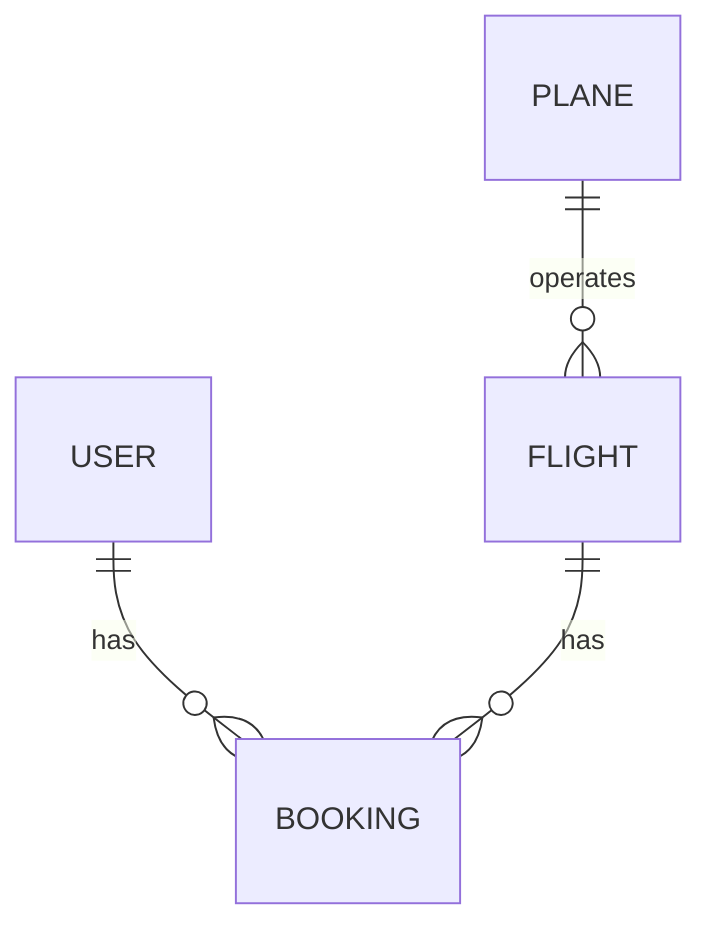

# Burning Airlines

A full stack flight booking project built with React, Ruby on Rails and PostgreSQL, using real flight schedule data from the OAG API. This is a handwritten proof-of-concept CRUD project, covering database design, frontend design and UX/UI, backend architecture, and API management.

The frontend and backend are maintained in separate repositories and deployed as separate services. This repository contains the [React client](https://github.com/tombryson/final-project-client); the [Rails API and PostgreSQL data model](https://github.com/tombryson/final-project) live in the backend repository.

The basic user story is simple:
Search for a flight or sign in, choose a seat and save the booking to your account.
Bookings appear in My Flights and can also be cancelled.

## Design and frontend

The visual design and custom CSS classes are handcrafted from scratch to create the best user experience and understand the language as thoroughly as possible. Bootstrap styles and a few React Bootstrap components are also used in the current client.

The curved layouts, airline styling, animation and responsive sizing are a big part of this project. Working directly with flexbox, grid, transforms and media queries has been an opportunity to understand how the page actually fits together.

Search, results, seat selection and confirmation have their own React components. The seat map generates its buttons from rows and columns, giving each seat a readable label like 12A. Authentication is shared through React Router's outlet context.

## API and backend

Flight schedules come directly from OAG through the Rails backend. The API key stays on the server. Prices are calculated locally using flight duration, carrier, departure time and how close the departure date is.

Saved API responses are included for data mocking. In tests, we substitute mock responses for the HTTP dependency so we can check successful searches, empty results and failures without making live API calls. The running app currently uses OAG; automatic switching between cached and live data depending on the environment is still unfinished.

Passwords are hashed with bcrypt and booking ownership comes from the authenticated user. A signed flight reference connects the search result to the saved booking, so the browser cannot simply submit different flight details.

## Entity-relationship model



A booking connects a user to a flight and stores their seat coordinates. Each flight belongs to a plane, which describes its layout. This lets one user book multiple flights and one flight have multiple bookings without repeating the user or flight details on every booking.

Flights retain the provider's schedule key, carrier, flight number, date and airports. The schedule key distinguishes a particular flight instance from a flight number that can repeat on another day.

Foreign keys protect the booking's user and flight relationships. A unique database index on flight, row and column prevents two people booking the same seat, even if both requests arrive together. Seat coordinates are also checked against the plane's dimensions.

## Running locally

Use Ruby 2.7.6, Bundler, PostgreSQL and Node.js/npm. Set `OAG_API_KEY` and, where required, `POSTGRES_PASSWORD` in an untracked backend `.env` file.

From the backend repository directory, `final-project`:

```sh
bundle install
bundle exec rails db:create db:migrate
bundle exec rails server -p 3000
```

From this frontend repository directory, `final-project-client`:

```sh
npm install
PORT=3001 npm start
```

Open http://localhost:3001. Backend tests run with `bundle exec rspec`. Focused frontend checks run with:

```sh
CI=true npm test -- --watchAll=false --runInBand --runTestsByPath src/authSession.test.js src/bookingFlow.test.js src/components/profile/UserProfile.test.js
```

## Proof of concept

This project is a completed proof of concept to handwrite a CRUD application in Rails and JavaScript. The aim was to understand how the frontend, backend and relational database work together, while building the design and user experience by hand.

The booking flow uses real flight schedules with calculated prices and a simulated aircraft layout. Users can save and cancel bookings, with the database preventing duplicate seat bookings. It demonstrates the application flow without issuing airline tickets or taking payments.
